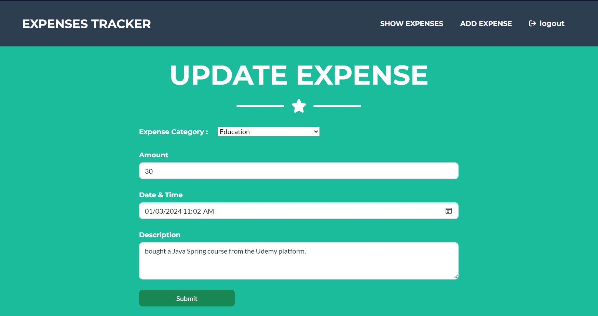

💰 Expenses Tracker App
The Expenses Tracker App is a robust personal finance management system built using modern technologies like Spring Boot, Spring Security, Thymeleaf, and MySQL. It empowers users to track their daily expenditures, categorize expenses, and visualize financial patterns using dynamic charts and graphs.

With a focus on security, usability, and data analysis, this app ensures users stay informed and in control of their financial life.

📌 Features
🔐 User Authentication & Authorization

Secure sign up, sign in, and role-based access control using Spring Security.

🧾 Expense Management (CRUD)

Add, update, view, and delete daily expenses.

Input categories (e.g., Food, Travel, Bills), amount, and notes.

📊 Visual Analytics

Pie Charts: Category-wise monthly or yearly expense distribution.

Bar/Line Graphs: Daily or monthly total expenses.

Powered by Chart.js for rich and responsive visualizations.

🧮 Filtering and Search

Filter expenses by date, category, or amount range.

Sort by latest, highest amount, or alphabetical category.

📅 Daily Expense Logs

Track individual day-by-day spending to monitor budget patterns.

🛠 Technologies Used
Layer	Technology
Backend	Java 21, Spring Boot
Security	Spring Security
ORM	Spring Data JPA
Database	MySQL
Frontend	Thymeleaf, Bootstrap
Visualization	Chart.js
Build Tool	Maven

## Getting Started
1. **Clone the Repository:**
`git clone https://github.com/yalamandap/expenses-tracker.git`

2. **Configure Database:**
Set up MySQL database and update the application.properties file with your database configuration.

3. **Build and Run:**
Build the project using your preferred IDE or with Maven:
`mvn clean install`.

4. **Run the application:**
`java -jar target/expenses-tracker.jar`.

5. **Access the App:**
Open your web browser and navigate to `http://localhost:8080`.

## ScreenShots
  
  
  
  
  
  
  
  

## Contributions
Contributions are welcome! If you find a bug or have suggestions for improvement, feel free to open an issue or create a pull request.

## License
This project is licensed under the MIT License.
